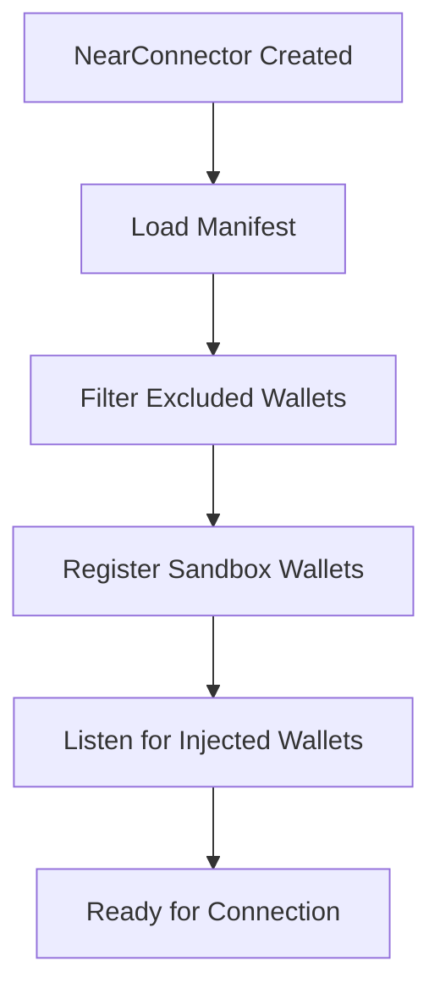

## Overview

NEAR Connect is built around a secure, sandboxed architecture that allows dApps to integrate multiple wallet types safely and uniformly. The architecture consists of three main components:

<CardGroup cols={3}>
  <Card title="Sandboxed Execution" icon="shield-halved">
    Wallet code runs in isolated iframes with strict permissions
  </Card>
  <Card title="Manifest System" icon="file-code">
    Standardized wallet definitions with features and permissions
  </Card>
  <Card title="Unified Interface" icon="plug">
    Single API for all wallet types (sandbox, injected, parent frame)
  </Card>
</CardGroup>

## Core Components

### NearConnector

The main entry point that orchestrates wallet loading, selection, and communication.

```typescript
import { NearConnector } from '@near-connect/core';

const connector = new NearConnector({
  network: 'mainnet',
  providers: {
    mainnet: ['https://rpc.mainnet.near.org'],
    testnet: ['https://rpc.testnet.near.org']
  },
  features: {
    signMessage: true,
    signAndSendTransaction: true
  }
});
```

<Note>
  The connector automatically loads wallet manifests from the repository and initializes available wallets based on the environment.
</Note>

### Manifest Loading System

Wallets are loaded from manifest files that describe their capabilities, permissions, and executor code location.

```typescript src/NearConnector.ts
private async _loadManifest(manifestUrl?: string) {
  const manifestEndpoints = manifestUrl ? [manifestUrl] : defaultManifests;
  for (const endpoint of manifestEndpoints) {
    const res = await fetch(endpoint).catch(() => null);
    if (!res || !res.ok) continue;
    return await res.json();
  }
  throw new Error('Failed to load manifest');
}
```

The manifest contains:

<AccordionGroup>
  <Accordion title="Wallet Metadata">
    - **id**: Unique identifier
    - **name**: Display name
    - **icon**: Logo URL
    - **description**: Brief description
    - **version**: Semantic version
  </Accordion>
  
  <Accordion title="Features">
    - `signMessage`: Message signing support
    - `signAndSendTransaction`: Transaction support
    - `signInWithoutAddKey`: Passwordless auth
    - `signInAndSignMessage`: Combined auth + signing
    - `mainnet`/`testnet`: Network support
  </Accordion>
  
  <Accordion title="Permissions">
    - `storage`: LocalStorage access
    - `external`: Access to browser APIs
    - `walletConnect`: WalletConnect protocol
    - `allowsOpen`: Allowed redirect URLs
    - `clipboardRead`/`clipboardWrite`: Clipboard access
    - `usb`/`hid`: Hardware wallet support
  </Accordion>
</AccordionGroup>

### Wallet Registration

Wallets are automatically registered from the manifest during initialization:

```typescript src/NearConnector.ts
await this.whenManifestLoaded;

this.manifest.wallets.forEach((wallet) => this.registerWallet(wallet));
```

<Info>
  Only sandbox wallets are registered from manifests. Injected wallets register themselves by dispatching the `near-wallet-injected` event.
</Info>

## Execution Flow

### 1. Initialization



### 2. Wallet Connection

When a user connects a wallet:

```typescript src/NearConnector.ts
async connect(input: NearConnector_ConnectOptions = {}) {
  let walletId = input.walletId;
  
  await this.whenManifestLoaded;
  if (!walletId) walletId = await this.selectWallet();
  
  const wallet = await this.wallet(walletId);
  await this.storage.set('selected-wallet', walletId);
  
  const accounts = await wallet.signIn({
    contractId: this.signInData?.contractId,
    methodNames: this.signInData?.methodNames,
    network: this.network,
  });
  
  this.events.emit('wallet:signIn', { wallet, accounts, success: true });
  return wallet;
}
```

<Steps>
  <Step title="Select Wallet">
    If no wallet ID provided, show selector popup
  </Step>
  <Step title="Store Selection">
    Save wallet ID to storage for auto-reconnect
  </Step>
  <Step title="Sign In">
    Call wallet's signIn method with contract context
  </Step>
  <Step title="Emit Event">
    Notify listeners of successful connection
  </Step>
</Steps>

### 3. Method Execution

For sandboxed wallets, method calls go through the executor:

```typescript src/SandboxedWallet/executor.ts
async call<T>(method: string, params: any): Promise<T> {
  const code = await this.loadCode();
  const iframe = new IframeExecutor(this, code, this._onMessage);
  
  await iframe.readyPromise;
  
  return new Promise<T>((resolve, reject) => {
    const handler = (event: MessageEvent) => {
      if (event.data.id !== id) return;
      
      iframe.dispose();
      window.removeEventListener('message', handler);
      
      if (event.data.status === 'failed') reject(event.data.result);
      else resolve(event.data.result);
    };
    
    window.addEventListener('message', handler);
    iframe.postMessage({ method, params, id });
  });
}
```

## Code Loading and Caching

Executor code is cached in IndexedDB for performance:

```typescript src/SandboxedWallet/executor.ts
async loadCode(): Promise<string> {
  const cachedCode = await this.connector.db.getItem<string>(
    `${this.manifest.id}:${this.manifest.version}`
  );
  
  const task = this.checkNewVersion(this, cachedCode);
  if (cachedCode) return cachedCode;
  return await task;
}
```

<Check>
  Cached code is returned immediately while new versions are fetched in the background.
</Check>

## Auto-Connect

NEAR Connect supports automatic reconnection:

```typescript
async getConnectedWallet() {
  await this.whenManifestLoaded;
  const id = await this.storage.get('selected-wallet');
  const wallet = this.wallets.find((wallet) => wallet.manifest.id === id);
  
  if (!wallet) throw new Error('No wallet selected');
  
  const accounts = await wallet.getAccounts();
  if (!accounts?.length) throw new Error('No accounts found');
  
  return { wallet, accounts };
}
```

<Warning>
  Auto-connect is enabled by default. Set `autoConnect: false` in the constructor to disable.
</Warning>

## Plugin System

Extend wallet functionality with middleware plugins:

```typescript src/NearConnector.ts
async use(plugin: WalletPlugin): Promise<void> {
  this.wallets = this.wallets.map((wallet) => {
    return new Proxy(wallet, {
      get(target, prop, receiver) {
        const originalValue = Reflect.get(target, prop, receiver);
        
        if (prop in plugin && typeof originalValue === 'function') {
          const pluginMethod = (plugin as any)[prop];
          
          return function (this: any, ...args: any[]) {
            const next = () => originalValue.apply(target, args);
            return pluginMethod.call(this, ...args, next);
          };
        }
        
        return originalValue;
      },
    });
  });
}
```

<Tip>
  Plugins can intercept and modify wallet method calls, add logging, analytics, or custom behavior.
</Tip>

## Network Switching

Switch between mainnet and testnet:

```typescript src/NearConnector.ts
async switchNetwork(
  network: 'mainnet' | 'testnet',
  signInData?: { contractId?: string; methodNames?: Array<string> }
) {
  if (this.network === network) return;
  await this.disconnect();
  if (signInData) this.signInData = signInData;
  this.network = network;
  await this.connect();
}
```

<Note>
  Switching networks disconnects the current wallet and requires re-authentication.
</Note>