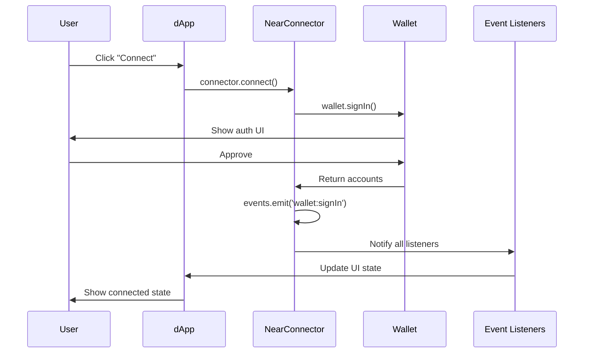

## Overview

NEAR Connect uses a typed event system to notify your application of wallet state changes and user actions.

<CardGroup cols={2}>
  <Card title="Type-Safe Events" icon="check-double">
    Full TypeScript support with typed event payloads
  </Card>
  <Card title="Real-Time Updates" icon="bolt">
    Immediate notifications of wallet state changes
  </Card>
</CardGroup>

## Event Emitter

The event system is built on a custom EventEmitter class:

```typescript src/helpers/events.ts
export class EventEmitter<T extends Record<string, any>> {
  private events: Partial<Record<keyof T, Array<(payload: any) => void>>> = {};

  on<K extends keyof T>(event: K, callback: (payload: T[K]) => void): void {
    if (!this.events[event]) this.events[event] = [];
    this.events[event]!.push(callback);
  }

  emit<K extends keyof T>(event: K, payload: T[K]): void {
    this.events[event]?.forEach((cb) => cb(payload));
  }

  off<K extends keyof T>(event: K, callback: (payload: T[K]) => void): void {
    this.events[event] = this.events[event]?.filter((cb) => cb !== callback);
  }

  once<K extends keyof T>(event: K, callback: (payload: T[K]) => void): void {
    const onceWrapper = (payload: T[K]) => {
      callback(payload);
      this.off(event, onceWrapper);
    };
    this.on(event, onceWrapper);
  }

  removeAllListeners<K extends keyof T>(event?: K): void {
    if (event) {
      delete this.events[event];
    } else {
      this.events = {};
    }
  }
}
```

<Info>
  The EventEmitter is generic and type-safe, ensuring you can't subscribe to non-existent events or receive wrong payload types.
</Info>

## Available Events

### Event Map

```typescript src/types/index.ts
export interface EventMap {
  'wallet:signIn': {
    wallet: NearWalletBase;
    accounts: Account[];
    success: boolean;
    source: 'signIn' | 'signInAndSignMessage';
  };
  'wallet:signInAndSignMessage': {
    wallet: NearWalletBase;
    accounts: AccountWithSignedMessage[];
    success: boolean;
  };
  'wallet:signOut': any;
  'selector:manifestUpdated': any;
  'selector:walletsChanged': any;
}
```

<AccordionGroup>
  <Accordion title="wallet:signIn" icon="right-to-bracket">
    Emitted when a user successfully signs in.
    
    **Payload**:
    ```typescript
    {
      wallet: NearWalletBase;      // The connected wallet instance
      accounts: Account[];          // Array of connected accounts
      success: boolean;             // Always true when emitted
      source: 'signIn' | 'signInAndSignMessage'; // Sign-in method used
    }
    ```
    
    **Example**:
    ```typescript
    connector.on('wallet:signIn', ({ wallet, accounts, source }) => {
      console.log(`Signed in with ${wallet.manifest.name}`);
      console.log(`Accounts:`, accounts);
      console.log(`Method: ${source}`);
    });
    ```
  </Accordion>
  
  <Accordion title="wallet:signInAndSignMessage" icon="signature">
    Emitted when a user signs in and signs a message simultaneously.
    
    **Payload**:
    ```typescript
    {
      wallet: NearWalletBase;                     // The wallet instance
      accounts: AccountWithSignedMessage[];       // Accounts with signatures
      success: boolean;                           // Always true when emitted
    }
    ```
    
    **AccountWithSignedMessage**:
    ```typescript
    interface AccountWithSignedMessage extends Account {
      accountId: string;
      publicKey?: string;
      signedMessage: SignedMessage;
    }
    
    interface SignedMessage {
      accountId: string;
      publicKey: string;
      signature: string;
    }
    ```
    
    **Example**:
    ```typescript
    connector.on('wallet:signInAndSignMessage', ({ accounts }) => {
      accounts.forEach(account => {
        console.log('Account:', account.accountId);
        console.log('Signature:', account.signedMessage.signature);
        // Verify signature for authentication
        verifySignature(account.signedMessage);
      });
    });
    ```
  </Accordion>
  
  <Accordion title="wallet:signOut" icon="right-from-bracket">
    Emitted when a user signs out.
    
    **Payload**: `any` (currently empty object)
    
    **Example**:
    ```typescript
    connector.on('wallet:signOut', () => {
      console.log('User signed out');
      // Clear application state
      clearUserSession();
    });
    ```
  </Accordion>
  
  <Accordion title="selector:walletsChanged" icon="wallet">
    Emitted when the list of available wallets changes (e.g., browser extension detected).
    
    **Payload**: `any` (currently empty object)
    
    **Example**:
    ```typescript
    connector.on('selector:walletsChanged', () => {
      console.log('Available wallets:', connector.availableWallets);
      // Update UI to show newly available wallets
      updateWalletList(connector.availableWallets);
    });
    ```
  </Accordion>
  
  <Accordion title="selector:manifestUpdated" icon="file-code">
    Emitted when the wallet manifest is updated.
    
    **Payload**: `any` (currently empty object)
    
    **Example**:
    ```typescript
    connector.on('selector:manifestUpdated', () => {
      console.log('Manifest updated');
      console.log('New version:', connector.manifest.version);
    });
    ```
  </Accordion>
</AccordionGroup>

## Event Emission

Events are emitted at key points in the wallet lifecycle:

### Sign In Events

```typescript src/NearConnector.ts
if (signMessageParams != null) {
  const accounts = await wallet.signInAndSignMessage({
    contractId: this.signInData?.contractId,
    methodNames: this.signInData?.methodNames,
    messageParams: signMessageParams,
    network: this.network,
  });

  if (!accounts?.length) throw new Error('Failed to sign in');

  this.events.emit('wallet:signInAndSignMessage', {
    wallet,
    accounts,
    success: true
  });
  
  this.events.emit('wallet:signIn', {
    wallet,
    accounts: accounts.map((account) => ({
      accountId: account.accountId,
      publicKey: account.publicKey,
    })),
    success: true,
    source: 'signInAndSignMessage',
  });
} else {
  const accounts = await wallet.signIn({
    contractId: this.signInData?.contractId,
    methodNames: this.signInData?.methodNames,
    network: this.network,
  });

  if (!accounts?.length) throw new Error('Failed to sign in');

  this.events.emit('wallet:signIn', {
    wallet,
    accounts,
    success: true,
    source: 'signIn'
  });
}
```

<Note>
  When using `signInAndSignMessage`, both `wallet:signInAndSignMessage` and `wallet:signIn` events are emitted, allowing you to listen to either based on your needs.
</Note>

### Sign Out Events

```typescript src/NearConnector.ts
async disconnect(wallet?: NearWalletBase) {
  if (!wallet) wallet = await this.wallet();
  await wallet.signOut({ network: this.network });

  await this.storage.remove('selected-wallet');
  this.events.emit('wallet:signOut', { success: true });
}
```

### Wallet Detection Events

```typescript src/NearConnector.ts
private _handleNearWalletInjected = (
  event: EventNearWalletInjected
) => {
  this.wallets = this.wallets.filter(
    (wallet) => wallet.manifest.id !== event.detail.manifest.id
  );
  this.wallets.unshift(new InjectedWallet(this, event.detail as any));
  this.events.emit('selector:walletsChanged', {});
};
```

## Subscribing to Events

NEAR Connect provides multiple methods for event subscription:

### on() - Persistent Listener

```typescript
connector.on('wallet:signIn', ({ wallet, accounts }) => {
  console.log('User signed in:', accounts[0].accountId);
});
```

### once() - Single-Use Listener

```typescript
connector.once('wallet:signIn', ({ wallet, accounts }) => {
  console.log('First sign-in detected');
  // This callback will only fire once, then auto-remove itself
});
```

### off() - Remove Listener

```typescript
const handler = ({ accounts }) => {
  console.log('Signed in:', accounts);
};

connector.on('wallet:signIn', handler);

// Later...
connector.off('wallet:signIn', handler);
```

<Warning>
  You must pass the same function reference to `off()` that you passed to `on()`. Arrow functions created inline cannot be removed.
</Warning>

### removeAllListeners() - Clear All

```typescript
// Remove all listeners for a specific event
connector.removeAllListeners('wallet:signIn');

// Remove ALL listeners for ALL events
connector.removeAllListeners();
```

## Usage Patterns

### React Integration

```typescript
import { useEffect, useState } from 'react';
import { NearConnector } from '@near-connect/core';

function WalletStatus({ connector }: { connector: NearConnector }) {
  const [account, setAccount] = useState<string | null>(null);

  useEffect(() => {
    const handleSignIn = ({ accounts }) => {
      setAccount(accounts[0].accountId);
    };

    const handleSignOut = () => {
      setAccount(null);
    };

    connector.on('wallet:signIn', handleSignIn);
    connector.on('wallet:signOut', handleSignOut);

    return () => {
      connector.off('wallet:signIn', handleSignIn);
      connector.off('wallet:signOut', handleSignOut);
    };
  }, [connector]);

  return (
    <div>
      {account ? `Connected: ${account}` : 'Not connected'}
    </div>
  );
}
```

### Analytics Tracking

```typescript
connector.on('wallet:signIn', ({ wallet, accounts, source }) => {
  analytics.track('Wallet Sign In', {
    walletId: wallet.manifest.id,
    walletName: wallet.manifest.name,
    accountCount: accounts.length,
    method: source,
  });
});

connector.on('wallet:signOut', () => {
  analytics.track('Wallet Sign Out');
});
```

### State Synchronization

```typescript
class WalletState {
  private connector: NearConnector;
  private currentWallet: NearWalletBase | null = null;
  private currentAccounts: Account[] = [];

  constructor(connector: NearConnector) {
    this.connector = connector;
    this.setupListeners();
  }

  private setupListeners() {
    this.connector.on('wallet:signIn', ({ wallet, accounts }) => {
      this.currentWallet = wallet;
      this.currentAccounts = accounts;
      this.notifyStateChange();
    });

    this.connector.on('wallet:signOut', () => {
      this.currentWallet = null;
      this.currentAccounts = [];
      this.notifyStateChange();
    });

    this.connector.on('selector:walletsChanged', () => {
      this.notifyWalletsChanged();
    });
  }

  private notifyStateChange() {
    // Trigger UI updates, Redux actions, etc.
  }

  private notifyWalletsChanged() {
    // Update available wallet list in UI
  }
}
```

### Error Handling

```typescript
connector.on('wallet:signIn', ({ wallet, accounts, success }) => {
  if (!success) {
    console.error('Sign-in failed');
    return;
  }

  if (!accounts.length) {
    console.error('No accounts returned');
    return;
  }

  console.log('Successfully signed in:', accounts[0].accountId);
});
```

## Custom Event Emitter

You can provide your own EventEmitter instance:

```typescript
import { EventEmitter } from '@near-connect/core';
import type { EventMap } from '@near-connect/core';

const customEvents = new EventEmitter<EventMap>();

// Add logging to all events
const originalEmit = customEvents.emit.bind(customEvents);
customEvents.emit = function(event, payload) {
  console.log('[Event]', event, payload);
  return originalEmit(event, payload);
};

const connector = new NearConnector({
  events: customEvents,
  network: 'mainnet'
});

// Now all events are logged automatically
connector.on('wallet:signIn', (data) => {
  // Your handler
});
```

<Tip>
  Custom EventEmitter instances are useful for debugging, analytics, or integrating with existing event systems.
</Tip>

## Event Flow Diagram



## Best Practices

<CardGroup cols={2}>
  <Card title="Always Clean Up" icon="broom">
    Remove event listeners in component cleanup to prevent memory leaks.
    ```typescript
    useEffect(() => {
      connector.on('wallet:signIn', handler);
      return () => connector.off('wallet:signIn', handler);
    }, []);
    ```
  </Card>
  
  <Card title="Use TypeScript" icon="code">
    TypeScript ensures you're using correct event names and payload types.
    ```typescript
    // ✅ Type-safe
    connector.on('wallet:signIn', (data) => {
      data.accounts // correctly typed
    });
    
    // ❌ Won't compile
    connector.on('invalid-event', () => {});
    ```
  </Card>
  
  <Card title="Handle Errors" icon="triangle-exclamation">
    Always check for success and validate payloads.
    ```typescript
    connector.on('wallet:signIn', ({ success, accounts }) => {
      if (!success || !accounts.length) {
        handleError();
        return;
      }
      handleSuccess(accounts);
    });
    ```
  </Card>
  
  <Card title="Avoid Side Effects" icon="shield">
    Keep event handlers focused and avoid heavy operations.
    ```typescript
    // ✅ Good: delegate to async function
    connector.on('wallet:signIn', ({ accounts }) => {
      updateAccountState(accounts);
    });
    
    // ❌ Bad: heavy sync operation
    connector.on('wallet:signIn', ({ accounts }) => {
      // Don't do expensive work here
    });
    ```
  </Card>
</CardGroup>