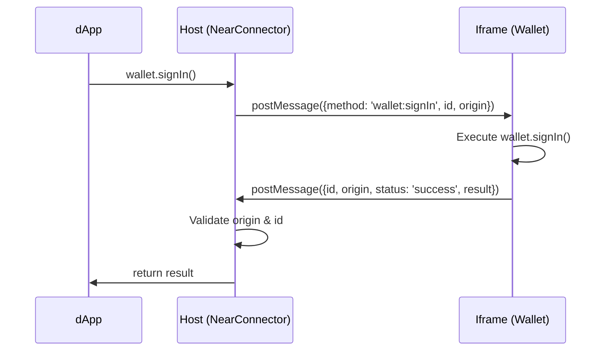

## Overview

NEAR Connect's security model is built on three core principles:

<CardGroup cols={3}>
  <Card title="Sandboxed Execution" icon="shield-halved">
    Wallet code runs in isolated iframes with no direct DOM access
  </Card>
  <Card title="Permission Control" icon="key">
    Fine-grained permissions for storage, network, and browser APIs
  </Card>
  <Card title="Code Isolation" icon="lock">
    Complete separation between wallet code and dApp code
  </Card>
</CardGroup>

## Iframe Sandboxing

Sandboxed wallets execute in iframes with strict Content Security Policy.

### Sandbox Attributes

```typescript src/SandboxedWallet/iframe.ts
const iframeAllowedPermissions = [];
if (this.executor.checkPermissions('usb')) {
  iframeAllowedPermissions.push('usb *;');
}
if (this.executor.checkPermissions('hid')) {
  iframeAllowedPermissions.push('hid *;');
}
if (this.executor.checkPermissions('clipboardRead')) {
  iframeAllowedPermissions.push('clipboard-read;');
}
if (this.executor.checkPermissions('clipboardWrite')) {
  iframeAllowedPermissions.push('clipboard-write;');
}
this.iframe.allow = iframeAllowedPermissions.join(' ');
this.iframe.setAttribute('sandbox', 'allow-scripts');
```

<Info>
  The `sandbox="allow-scripts"` attribute provides the strictest isolation while allowing JavaScript execution. This prevents:
  - Form submissions
  - Popup windows (unless permitted)
  - Same-origin access
  - Navigation of top-level frame
  - Automatic feature execution
</Info>

### Code Transformation

Before execution, wallet code is transformed to prevent escaping the sandbox:

```typescript src/SandboxedWallet/code.ts
const code = args.code
  .replaceAll('.localStorage', '.sandboxedLocalStorage')
  .replaceAll('window.top', 'window.selector')
  .replaceAll('window.open', 'window.selector.open');
```

<Warning>
  Direct access to `localStorage`, `window.top`, and `window.open` is replaced with controlled alternatives to prevent sandbox escape.
</Warning>

## Permission System

Wallets must declare required permissions in their manifest.

### Available Permissions

<AccordionGroup>
  <Accordion title="storage" icon="database">
    **Type**: `boolean`
    
    Allows wallet to store data in namespaced localStorage.
    
    ```json
    "permissions": {
      "storage": true
    }
    ```
    
    Storage keys are automatically namespaced:
    ```typescript
    localStorage.setItem(`${walletId}:${key}`, value);
    ```
  </Accordion>
  
  <Accordion title="external" icon="arrow-up-right-from-square">
    **Type**: `string[]`
    
    Allows access to specific browser APIs or injected objects.
    
    ```json
    "permissions": {
      "external": ["nightly.near", "meteorCom"]
    }
    ```
    
    Used for calling browser extension APIs:
    ```typescript
    window.selector.external('nightly.near', 'signTransaction', args);
    ```
  </Accordion>
  
  <Accordion title="walletConnect" icon="link">
    **Type**: `boolean`
    
    Enables WalletConnect protocol integration.
    
    ```json
    "permissions": {
      "walletConnect": true
    }
    ```
    
    Provides access to:
    ```typescript
    window.selector.walletConnect.connect(params);
    window.selector.walletConnect.request(params);
    ```
  </Accordion>
  
  <Accordion title="allowsOpen" icon="arrow-up-right-from-square">
    **Type**: `string[]`
    
    Whitelist of URLs the wallet can open in new windows/tabs.
    
    ```json
    "permissions": {
      "allowsOpen": [
        "https://wallet.meteorwallet.app",
        "https://chromewebstore.google.com"
      ]
    }
    ```
  </Accordion>
  
  <Accordion title="clipboardRead / clipboardWrite" icon="clipboard">
    **Type**: `boolean`
    
    Enables clipboard access for reading/writing.
    
    ```json
    "permissions": {
      "clipboardRead": false,
      "clipboardWrite": true
    }
    ```
  </Accordion>
  
  <Accordion title="usb / hid" icon="usb">
    **Type**: `boolean`
    
    Allows USB/HID device access for hardware wallets.
    
    ```json
    "permissions": {
      "usb": true,
      "hid": true
    }
    ```
  </Accordion>
</AccordionGroup>

### Permission Checking

Every privileged operation is validated:

```typescript src/SandboxedWallet/executor.ts
checkPermissions(
  action: keyof WalletPermissions,
  params?: { url?: string; entity?: string }
) {
  if (action === 'walletConnect') {
    return !!this.manifest.permissions.walletConnect;
  }

  if (action === 'external') {
    const external = this.manifest.permissions.external;
    if (!external || !params?.entity) return false;
    return external.includes(params.entity);
  }

  if (action === 'allowsOpen') {
    const openUrl = parseUrl(params?.url || '');
    const allowsOpen = this.manifest.permissions.allowsOpen;

    if (!openUrl || !allowsOpen || !Array.isArray(allowsOpen)) {
      return false;
    }
    
    const isAllowed = allowsOpen.some((path) => {
      const url = parseUrl(path);
      if (!url) return false;

      if (openUrl.protocol !== url.protocol) return false;
      if (!!url.hostname && openUrl.hostname !== url.hostname) {
        return false;
      }
      if (!!url.pathname && url.pathname !== '/' && 
          openUrl.pathname !== url.pathname) {
        return false;
      }
      return true;
    });

    return isAllowed;
  }

  return this.manifest.permissions[action];
}
```

<Check>
  Permission checks happen on every sandbox API call - there's no way for wallet code to bypass these checks.
</Check>

### Permission Assertions

```typescript src/SandboxedWallet/executor.ts
assertPermissions(
  iframe: IframeExecutor,
  action: keyof WalletPermissions,
  event: MessageEvent
) {
  if (!this.checkPermissions(action, event.data.params)) {
    iframe.postMessage({
      ...event.data,
      status: 'failed',
      result: 'Permission denied'
    });
    throw new Error('Permission denied');
  }
}
```

## Sandboxed Storage

Wallet storage is completely isolated from the dApp.

### Implementation

```typescript src/SandboxedWallet/code.ts
window.sandboxedLocalStorage = (() => {
  let storage = ${JSON.stringify(storage)}

  return {
    setItem: function(key, value) {
      window.selector.storage.set(key, value)
      storage[key] = value || '';
    },
    getItem: function(key) {
      return key in storage ? storage[key] : null;
    },
    removeItem: function(key) {
      window.selector.storage.remove(key)
      delete storage[key];
    },
    get length() {
      return Object.keys(storage).length;
    },
    key: function(i) {
      const keys = Object.keys(storage);
      return keys[i] || null;
    },
  };
})();
```

### Host-Side Storage

```typescript src/SandboxedWallet/executor.ts
if (event.data.method === 'storage.set') {
  this.assertPermissions(iframe, 'storage', event);
  localStorage.setItem(
    `${this.storageSpace}:${event.data.params.key}`,
    event.data.params.value
  );
  success(null);
  return;
}

if (event.data.method === 'storage.get') {
  this.assertPermissions(iframe, 'storage', event);
  const value = localStorage.getItem(
    `${this.storageSpace}:${event.data.params.key}`
  );
  success(value);
  return;
}
```

<Info>
  Each wallet gets its own storage namespace (`walletId:key`) ensuring complete data isolation between wallets.
</Info>

## Communication Security

All wallet-host communication uses postMessage with origin validation.

### Message Flow



### Origin Validation

```typescript src/SandboxedWallet/iframe.ts
this.handler = (event: MessageEvent) => {
  if (event.data.origin !== this.origin) return;
  if (event.data.method === 'wallet-ready') {
    this.readyPromiseResolve();
  }
  onMessage(this, event);
};
```

<Warning>
  Each iframe gets a unique UUID as its origin identifier. Messages without matching origin are silently ignored.
</Warning>

## URL Opening Security

Wallets can only open whitelisted URLs.

### URL Validation

```typescript src/SandboxedWallet/executor.ts
if (event.data.method === 'open') {
  this.assertPermissions(iframe, 'allowsOpen', event);

  const panel = window.open(
    event.data.params.url,
    '_blank',
    event.data.params.features
  );
  const panelId = panel ? uuid4() : null;
  
  // Only forward messages from the opened URL's origin
  const handler = (ev: MessageEvent) => {
    const url = parseUrl(event.data.params.url);
    if (url && url.origin === ev.origin) {
      iframe.postMessage(ev.data);
    }
  };
  
  window.addEventListener('message', handler);
}
```

### Native App Protection

```typescript src/SandboxedWallet/executor.ts
if (event.data.method === 'open.nativeApp') {
  this.assertPermissions(iframe, 'allowsOpen', event);

  const url = parseUrl(event.data.params.url);
  const invalid = [
    'https', 'http', 'javascript:', 'file:', 'data:', 'blob:', 'about:'
  ];
  
  if (!url || invalid.includes(url.protocol)) {
    failed('Invalid URL');
    throw new Error('[open.nativeApp] Invalid URL');
  }
  
  // Safe to open custom protocol URLs (e.g., hotwallet://)
  const linkIframe = document.createElement('iframe');
  linkIframe.src = event.data.params.url;
  linkIframe.style.display = 'none';
  document.body.appendChild(linkIframe);
}
```

<Check>
  HTTP(S) URLs are blocked for native app opening to prevent phishing. Only custom protocol schemes are allowed.
</Check>

## External API Security

Access to browser-injected objects is strictly controlled.

```typescript src/SandboxedWallet/executor.ts
if (event.data.method === 'external') {
  this.assertPermissions(iframe, 'external', event);
  try {
    const { entity, key, args } = event.data.params;
    const obj = entity.split('.').reduce(
      (acc: any, key: string) => acc[key],
      window
    );

    const result = typeof obj[key] === 'function'
      ? await obj[key](...(args || []))
      : obj[key];
    success(result);
  } catch (e) {
    failed(e);
  }
  return;
}
```

<Warning>
  Only explicitly whitelisted entities (e.g., `nightly.near`, `meteorCom`) can be accessed. This prevents wallets from accessing arbitrary globals.
</Warning>

## Code Integrity

Executor code is cached with version tracking.

### Version Checking

```typescript src/SandboxedWallet/executor.ts
async checkNewVersion(
  executor: SandboxExecutor,
  currentVersion: string | null
) {
  let url = parseUrl(executor.manifest.executor);
  if (!url) {
    url = parseUrl(location.origin + executor.manifest.executor);
  }
  if (!url) throw new Error('Invalid executor URL');

  url.searchParams.set('nonce', cacheId);
  const newVersion = await fetch(url.toString()).then((res) => res.text());

  if (newVersion === currentVersion) {
    return this.actualCode;
  }

  await this.connector.db.setItem(
    `${this.manifest.id}:${this.manifest.version}`,
    newVersion
  );
  return newVersion;
}
```

<Info>
  Cached code is used immediately while updates are fetched in the background, ensuring performance without sacrificing security.
</Info>

## Security Best Practices

<CardGroup cols={2}>
  <Card title="For Wallet Developers" icon="code">
    - Minimize requested permissions
    - Never store sensitive data in localStorage
    - Validate all user inputs
    - Use HTTPS for executor URLs
    - Implement proper error handling
  </Card>
  <Card title="For dApp Developers" icon="laptop-code">
    - Never trust wallet responses blindly
    - Verify transaction results on-chain
    - Use `excludedWallets` to remove untrusted wallets
    - Monitor wallet events for suspicious activity
    - Validate signed messages independently
  </Card>
</CardGroup>

## Limitations

<Warning title="Current Security Limitations">
  - No cryptographic verification of executor code
  - Manifest files are fetched over HTTPS but not signed
  - Permission system relies on correct manifest declaration
  - Code transformation uses simple string replacement
</Warning>

<Info>
  Future versions may include code signing, manifest verification, and more robust code transformation.
</Info>