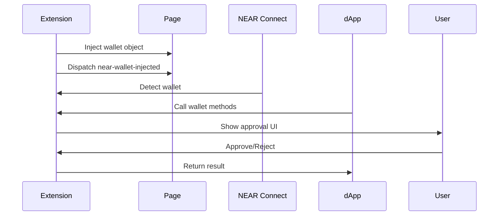

Browser extension wallets can inject wallet objects directly into the page, providing a more seamless user experience compared to sandboxed wallets. This guide shows you how to make your extension compatible with NEAR Connect.

## How It Works

Injected wallets work by:

1. **Extension Injection** - Your extension injects a wallet object into `window`
2. **Event Dispatch** - Extension dispatches a `near-wallet-injected` event
3. **Auto-Detection** - NEAR Connect detects and registers your wallet
4. **Direct Communication** - dApp calls methods directly on your wallet object



## Implementation Steps

<Steps>
  <Step title="Create Wallet Object">
    Implement the NEAR wallet interface.
  </Step>
  
  <Step title="Inject into Page">
    Inject your wallet object from content script.
  </Step>
  
  <Step title="Dispatch Event">
    Tell NEAR Connect about your wallet.
  </Step>
  
  <Step title="Handle Methods">
    Implement wallet methods and show UI.
  </Step>
</Steps>

## Basic Implementation

### 1. Create Wallet Manifest

Your extension still needs a manifest, but `type` is set to `"injected"`:

```json manifest.json
{
  "id": "my-extension-wallet",
  "name": "My Extension Wallet",
  "icon": "https://wallet.example.com/icon.png",
  "description": "Secure browser extension wallet for NEAR",
  "website": "https://wallet.example.com",
  "version": "1.0.0",
  "executor": "",  // Not used for injected wallets
  "type": "injected",
  
  "platform": {
    "chrome": "https://chromewebstore.google.com/detail/my-wallet/abc123",
    "firefox": "https://addons.mozilla.org/addon/my-wallet"
  },
  
  "features": {
    "signMessage": true,
    "signInWithoutAddKey": true,
    "signAndSendTransaction": true,
    "signAndSendTransactions": true,
    "mainnet": true,
    "testnet": true
  },
  
  "permissions": {}
}
```

### 2. Implement Wallet Interface

Create a class implementing the NEAR wallet interface:

```javascript content-script.js
class MyExtensionWallet {
  constructor() {
    this.manifest = {
      id: "my-extension-wallet",
      name: "My Extension Wallet",
      icon: "https://wallet.example.com/icon.png",
      description: "Secure browser extension wallet for NEAR",
      website: "https://wallet.example.com",
      version: "1.0.0",
      executor: "",
      type: "injected",
      
      platform: {
        chrome: "https://chromewebstore.google.com/detail/my-wallet/abc123"
      },
      
      features: {
        signMessage: true,
        signInWithoutAddKey: true,
        signAndSendTransaction: true,
        signAndSendTransactions: true,
        mainnet: true,
        testnet: true
      },
      
      permissions: {}
    };
  }
  
  async signIn({ network, contractId, methodNames }) {
    // Send message to background script
    const response = await chrome.runtime.sendMessage({
      type: 'SIGN_IN',
      params: { network, contractId, methodNames }
    });
    
    if (response.error) {
      throw new Error(response.error);
    }
    
    return response.accounts;
  }
  
  async signOut({ network }) {
    await chrome.runtime.sendMessage({
      type: 'SIGN_OUT',
      params: { network }
    });
  }
  
  async getAccounts({ network }) {
    const response = await chrome.runtime.sendMessage({
      type: 'GET_ACCOUNTS',
      params: { network }
    });
    
    return response.accounts || [];
  }
  
  async signAndSendTransaction(params) {
    const response = await chrome.runtime.sendMessage({
      type: 'SIGN_AND_SEND_TRANSACTION',
      params
    });
    
    if (response.error) {
      throw new Error(response.error);
    }
    
    return response.result;
  }
  
  async signAndSendTransactions(params) {
    const response = await chrome.runtime.sendMessage({
      type: 'SIGN_AND_SEND_TRANSACTIONS',
      params
    });
    
    if (response.error) {
      throw new Error(response.error);
    }
    
    return response.results;
  }
  
  async signMessage(params) {
    const response = await chrome.runtime.sendMessage({
      type: 'SIGN_MESSAGE',
      params
    });
    
    if (response.error) {
      throw new Error(response.error);
    }
    
    return response.signedMessage;
  }
  
  async signInAndSignMessage(params) {
    const response = await chrome.runtime.sendMessage({
      type: 'SIGN_IN_AND_SIGN_MESSAGE',
      params
    });
    
    if (response.error) {
      throw new Error(response.error);
    }
    
    return response.accounts;
  }
  
  async signDelegateActions(params) {
    const response = await chrome.runtime.sendMessage({
      type: 'SIGN_DELEGATE_ACTIONS',
      params
    });
    
    if (response.error) {
      throw new Error(response.error);
    }
    
    return response;
  }
}

// Inject wallet into page
const wallet = new MyExtensionWallet();

// Make wallet available globally (optional, for other integrations)
window.myExtensionWallet = wallet;

// Dispatch event to notify NEAR Connect
window.dispatchEvent(
  new CustomEvent('near-wallet-injected', {
    detail: wallet
  })
);

// Also notify via postMessage (for cross-origin iframes)
window.postMessage(
  {
    type: 'near-wallet-injected',
    manifest: wallet.manifest
  },
  '*'
);
```

### 3. Background Script

Handle wallet operations in your extension's background script:

```javascript background.js
chrome.runtime.onMessage.addListener((message, sender, sendResponse) => {
  handleMessage(message, sender)
    .then(sendResponse)
    .catch(error => {
      sendResponse({ error: error.message });
    });
  
  return true; // Keep channel open for async response
});

async function handleMessage(message, sender) {
  switch (message.type) {
    case 'SIGN_IN': {
      // Show extension popup for sign in
      const accounts = await showSignInUI(message.params);
      return { accounts };
    }
    
    case 'SIGN_OUT': {
      await clearAccounts(message.params.network);
      return {};
    }
    
    case 'GET_ACCOUNTS': {
      const accounts = await loadAccounts(message.params.network);
      return { accounts };
    }
    
    case 'SIGN_AND_SEND_TRANSACTION': {
      // Show transaction approval UI
      const result = await showTransactionUI(message.params);
      return { result };
    }
    
    case 'SIGN_AND_SEND_TRANSACTIONS': {
      const results = await showMultiTransactionUI(message.params);
      return { results };
    }
    
    case 'SIGN_MESSAGE': {
      const signedMessage = await showMessageSignUI(message.params);
      return { signedMessage };
    }
    
    default:
      throw new Error(`Unknown message type: ${message.type}`);
  }
}

// Example: Show transaction approval UI
async function showTransactionUI(params) {
  return new Promise((resolve, reject) => {
    // Create notification or popup
    chrome.windows.create({
      url: chrome.runtime.getURL(`popup.html?request=${encodeURIComponent(JSON.stringify(params))}`),
      type: 'popup',
      width: 400,
      height: 600
    }, (window) => {
      // Listen for response from popup
      const listener = (message) => {
        if (message.type === 'TRANSACTION_RESPONSE' && message.windowId === window.id) {
          chrome.runtime.onMessage.removeListener(listener);
          
          if (message.approved) {
            // Sign and send transaction
            signAndSend(params)
              .then(resolve)
              .catch(reject);
          } else {
            reject(new Error('User rejected transaction'));
          }
        }
      };
      
      chrome.runtime.onMessage.addListener(listener);
    });
  });
}
```

## Complete Example: OKX Wallet Pattern

Here's how OKX wallet integrates with NEAR Connect:

```javascript okx-integration.js
// OKX Extension injects okxwallet object
window.okxwallet = {
  near: {
    async connect() { /* ... */ },
    async signAndSendTransaction(params) { /* ... */ },
    async signMessage(params) { /* ... */ }
  }
};

// NEAR Connect wrapper for OKX
class OKXNearWallet {
  constructor() {
    this.manifest = {
      id: "okx-wallet",
      name: "OKX Wallet",
      type: "injected",
      features: { /* ... */ }
    };
  }
  
  async signAndSendTransaction(params) {
    // Delegate to OKX's native implementation
    return await window.okxwallet.near.signAndSendTransaction(params);
  }
  
  // ... other methods
}

// Inject and notify
const wallet = new OKXNearWallet();
window.dispatchEvent(
  new CustomEvent('near-wallet-injected', { detail: wallet })
);
```

## Event Timing

<Warning>
  **Important:** Dispatch the `near-wallet-injected` event as early as possible, ideally in a content script that runs at `document_start` or `document_idle`.
</Warning>

```json Chrome Extension Manifest V3
{
  "manifest_version": 3,
  "content_scripts": [
    {
      "matches": ["<all_urls>"],
      "js": ["content-script.js"],
      "run_at": "document_start"
    }
  ]
}
```

## Listening for NEAR Connect

Some dApps might load NEAR Connect after your extension injects. Listen for the selector-ready event:

```javascript
// Inject wallet immediately
const wallet = new MyExtensionWallet();
window.myWallet = wallet;

// Dispatch event now
window.dispatchEvent(
  new CustomEvent('near-wallet-injected', { detail: wallet })
);

// Re-dispatch when NEAR Connect loads
window.addEventListener('near-selector-ready', () => {
  console.log('NEAR Connect is ready, re-injecting wallet');
  window.dispatchEvent(
    new CustomEvent('near-wallet-injected', { detail: wallet })
  );
});
```

## Actions Format

Your wallet will receive actions in this format:

```typescript
type Action = {
  // Simplified format
  method: string;
  params: any;
  gas?: string;
  deposit?: string;
} | {
  // NEAR-JS format
  type: 'FunctionCall' | 'Transfer' | 'CreateAccount' | ...;
  params: any;
};
```

Convert simplified to NEAR-JS format if needed:

```javascript
function normalizeAction(action) {
  if (action.type) {
    // Already in NEAR-JS format
    return action;
  }
  
  // Convert simplified format
  return {
    type: 'FunctionCall',
    params: {
      methodName: action.method,
      args: action.params || {},
      gas: action.gas || '30000000000000',
      deposit: action.deposit || '0'
    }
  };
}
```

## Testing Your Extension

<Steps>
  <Step title="Load Unpacked Extension">
    In Chrome: `chrome://extensions` → Enable Developer Mode → Load Unpacked
  </Step>
  
  <Step title="Open Test dApp">
    Navigate to a dApp using NEAR Connect or create a test page.
  </Step>
  
  <Step title="Check Detection">
    Open console and verify your wallet appears:
    ```javascript
    window.addEventListener('near-wallet-injected', (e) => {
      console.log('Wallet detected:', e.detail.manifest);
    });
    ```
  </Step>
  
  <Step title="Test Methods">
    Try connecting and signing transactions through the dApp.
  </Step>
</Steps>

## Advantages vs. Sandboxed Wallets

<CardGroup cols={2}>
  <Card title="Full Page Access" icon="globe">
    Access all page APIs without restrictions.
  </Card>
  
  <Card title="Better Performance" icon="rocket">
    No iframe overhead, direct method calls.
  </Card>
  
  <Card title="Native Integration" icon="plug">
    Can integrate with existing extension wallets.
  </Card>
  
  <Card title="Persistent State" icon="database">
    Use extension storage APIs directly.
  </Card>
</CardGroup>

## Disadvantages vs. Sandboxed Wallets

<Warning>
  **Security Considerations:**
  
  - Full page access means less isolation from potentially malicious dApps
  - Users must install your extension (higher friction)
  - Limited to desktop browsers with extension support
  - Cannot support mobile web browsers
</Warning>

## Best Practices

<AccordionGroup>
  <Accordion title="Early Injection">
    Inject your wallet as early as possible (`document_start`) to ensure it's available before dApp code runs.
  </Accordion>
  
  <Accordion title="Error Handling">
    Provide clear error messages when operations fail:
    
    ```javascript
    async signAndSendTransaction(params) {
      try {
        return await this.sendToBackground('SIGN_TX', params);
      } catch (error) {
        if (error.code === 'USER_REJECTED') {
          throw new Error('User rejected the transaction');
        }
        throw new Error(`Transaction failed: ${error.message}`);
      }
    }
    ```
  </Accordion>
  
  <Accordion title="State Synchronization">
    Keep content script and background script in sync:
    
    ```javascript
    // Listen for account changes in background
    chrome.storage.onChanged.addListener((changes) => {
      if (changes.accounts) {
        // Notify page about account change
        window.dispatchEvent(
          new CustomEvent('accountsChanged', {
            detail: changes.accounts.newValue
          })
        );
      }
    });
    ```
  </Accordion>
  
  <Accordion title="Manifest Accuracy">
    Keep manifest features accurate. Only declare features you fully support.
  </Accordion>
</AccordionGroup>

## Example: Minimal Extension

Here's a complete minimal extension:

<CodeGroup>
```json manifest.json (Extension Manifest)
{
  "manifest_version": 3,
  "name": "NEAR Example Wallet",
  "version": "1.0.0",
  "description": "Example NEAR wallet extension",
  
  "permissions": [
    "storage"
  ],
  
  "background": {
    "service_worker": "background.js"
  },
  
  "content_scripts": [
    {
      "matches": ["<all_urls>"],
      "js": ["content-script.js"],
      "run_at": "document_start"
    }
  ],
  
  "action": {
    "default_popup": "popup.html"
  }
}
```

```javascript content-script.js
class NearExampleWallet {
  manifest = {
    id: "near-example-wallet",
    name: "NEAR Example Wallet",
    icon: "https://example.com/icon.png",
    description: "Example wallet",
    website: "https://example.com",
    version: "1.0.0",
    executor: "",
    type: "injected",
    platform: {},
    features: {
      signMessage: true,
      signAndSendTransaction: true,
      signAndSendTransactions: true,
      mainnet: true,
      testnet: true
    },
    permissions: {}
  };
  
  async signIn(params) {
    const response = await chrome.runtime.sendMessage({
      type: 'SIGN_IN',
      params
    });
    return response.accounts;
  }
  
  async signOut(params) {
    await chrome.runtime.sendMessage({ type: 'SIGN_OUT', params });
  }
  
  async getAccounts(params) {
    const response = await chrome.runtime.sendMessage({
      type: 'GET_ACCOUNTS',
      params
    });
    return response.accounts || [];
  }
  
  async signAndSendTransaction(params) {
    const response = await chrome.runtime.sendMessage({
      type: 'SIGN_TRANSACTION',
      params
    });
    return response.result;
  }
  
  async signAndSendTransactions(params) {
    const response = await chrome.runtime.sendMessage({
      type: 'SIGN_TRANSACTIONS',
      params
    });
    return response.results;
  }
  
  async signMessage(params) {
    const response = await chrome.runtime.sendMessage({
      type: 'SIGN_MESSAGE',
      params
    });
    return response.signedMessage;
  }
}

const wallet = new NearExampleWallet();
window.dispatchEvent(
  new CustomEvent('near-wallet-injected', { detail: wallet })
);
```
</CodeGroup>

## Next Steps

<CardGroup cols={2}>
  <Card title="Testing Guide" icon="flask" href="/wallet-integration/testing">
    Learn how to test your extension wallet
  </Card>
  
  <Card title="Manifest Reference" icon="book" href="/wallet-integration/manifest-format">
    Complete manifest.json documentation
  </Card>
  
  <Card title="Sandbox Alternative" icon="box" href="/wallet-integration/creating-executor">
    Consider sandboxed wallets for mobile support
  </Card>
</CardGroup>
