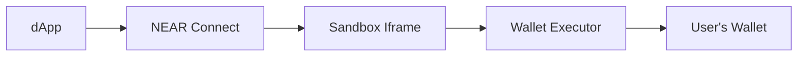

NEAR Connect provides a flexible wallet integration system that allows wallet developers to add their wallets to the ecosystem with minimal effort. Once integrated, your wallet becomes instantly available to all dApps using NEAR Connect.

## Integration Types

NEAR Connect supports two types of wallet integrations:

<CardGroup cols={2}>
  <Card title="Sandboxed Wallets" icon="box" href="/wallet-integration/creating-executor">
    Run wallet logic in an isolated iframe sandbox with controlled permissions. Ideal for web wallets and mobile deep-link wallets.
  </Card>
  <Card title="Injected Wallets" icon="plug" href="/wallet-integration/injected-wallets">
    Browser extension wallets that inject directly into the page context. Full access to page APIs.
  </Card>
</CardGroup>

## How It Works

### Sandboxed Wallets

Sandboxed wallets run inside a secure iframe with restricted permissions:

1. **Manifest Definition** - Define your wallet's metadata, features, and required permissions in `manifest.json`
2. **Executor Script** - Create a JavaScript file that implements the wallet interface
3. **Sandbox API** - Use `window.selector` API to communicate with the host page
4. **Permission System** - Request only the permissions your wallet needs



### Injected Wallets

Browser extensions inject wallet objects directly:

1. **Extension Installation** - User installs your browser extension
2. **Wallet Injection** - Extension injects wallet object into page
3. **Event Dispatch** - Extension dispatches `near-wallet-injected` event
4. **Auto-Detection** - NEAR Connect automatically detects and registers your wallet

## Getting Started

<Steps>
  <Step title="Choose Your Integration Type">
    - Use **sandboxed** for web wallets, mobile wallets, or WalletConnect
    - Use **injected** for browser extension wallets
  </Step>
  
  <Step title="Create Wallet Manifest">
    Define your wallet's metadata, features, and permissions in the manifest format.
    
    <Card title="Manifest Format" icon="file-code" href="/wallet-integration/manifest-format">
      Complete reference for all manifest fields
    </Card>
  </Step>
  
  <Step title="Implement Wallet Logic">
    Create an executor script (sandboxed) or inject wallet object (extension).
    
    <CardGroup cols={2}>
      <Card title="Executor Guide" icon="code" href="/wallet-integration/creating-executor">
        Build a sandboxed wallet executor
      </Card>
      <Card title="Sandbox API" icon="window" href="/wallet-integration/sandbox-api">
        Learn the available APIs
      </Card>
    </CardGroup>
  </Step>
  
  <Step title="Test Your Integration">
    Use debug mode to test your wallet before publishing.
    
    <Card title="Testing Guide" icon="flask" href="/wallet-integration/testing">
      Debug and test your wallet integration
    </Card>
  </Step>
  
  <Step title="Submit to Repository">
    Add your wallet to the official manifest repository to make it available to all dApps.
  </Step>
</Steps>

## Real-World Examples

NEAR Connect already integrates with many popular wallets:

<AccordionGroup>
  <Accordion title="HOT Wallet - Multi-platform Wallet">
    - **Type:** Sandboxed
    - **Platforms:** Web, iOS, Android, Chrome Extension, Firefox, Telegram
    - **Features:** Full transaction signing, message signing, deep links
    - **Permissions:** Storage, clipboard write, multiple platform URLs
    
    ```json
    {
      "id": "hot-wallet",
      "type": "sandbox",
      "platform": {
        "android": "https://play.google.com/...",
        "ios": "https://apps.apple.com/...",
        "chrome": "https://chromewebstore.google.com/..."
      },
      "permissions": {
        "storage": true,
        "allowsOpen": [
          "https://download.hot-labs.org",
          "https://t.me/hot_wallet/app",
          "hotwallet://"
        ]
      }
    }
    ```
  </Accordion>
  
  <Accordion title="Meteor Wallet - Web Wallet with Extension">
    - **Type:** Sandboxed with extension support
    - **Features:** Sign in without add key, delegate actions, both networks
    - **Permissions:** Storage, external API access
    
    ```json
    {
      "id": "meteor-wallet",
      "type": "sandbox",
      "features": {
        "signInWithoutAddKey": true,
        "signInAndSignMessage": true,
        "signDelegateActions": true
      },
      "permissions": {
        "storage": true,
        "external": ["meteorCom", "meteorComV2"]
      }
    }
    ```
  </Accordion>
  
  <Accordion title="OKX Wallet - External API Integration">
    - **Type:** Sandboxed
    - **Integration:** Uses external `okxwallet.near` object
    - **Platforms:** Chrome, Edge, iOS
    
    ```json
    {
      "id": "okx-wallet",
      "type": "sandbox",
      "permissions": {
        "storage": true,
        "external": ["okxwallet.near"]
      }
    }
    ```
  </Accordion>
  
  <Accordion title="WalletConnect - Protocol Integration">
    - **Type:** Sandboxed
    - **Special Permission:** WalletConnect protocol access
    - **Features:** QR code scanning, clipboard for pairing
    
    ```json
    {
      "id": "wallet-connect",
      "type": "sandbox",
      "permissions": {
        "storage": true,
        "clipboardWrite": true,
        "walletConnect": true
      }
    }
    ```
  </Accordion>
</AccordionGroup>

## Key Benefits

<CardGroup cols={3}>
  <Card title="Instant Distribution" icon="rocket">
    Your wallet becomes available to all dApps using NEAR Connect immediately after integration.
  </Card>
  
  <Card title="Security First" icon="shield">
    Sandboxed execution ensures wallets can't access sensitive page data without explicit permissions.
  </Card>
  
  <Card title="Cross-Platform" icon="mobile">
    Support web, mobile, and browser extensions from a single integration.
  </Card>
</CardGroup>

## Next Steps

<CardGroup cols={2}>
  <Card title="Create Executor Script" icon="code" href="/wallet-integration/creating-executor">
    Learn how to build a sandboxed wallet executor
  </Card>
  
  <Card title="Manifest Format Reference" icon="book" href="/wallet-integration/manifest-format">
    Complete manifest.json documentation
  </Card>
  
  <Card title="Sandbox API Reference" icon="window" href="/wallet-integration/sandbox-api">
    Explore available APIs for wallet scripts
  </Card>
  
  <Card title="Testing Your Wallet" icon="flask" href="/wallet-integration/testing">
    Debug mode and testing strategies
  </Card>
</CardGroup>
